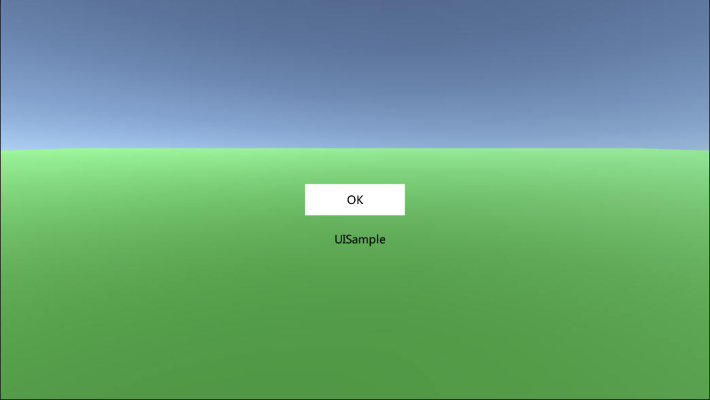
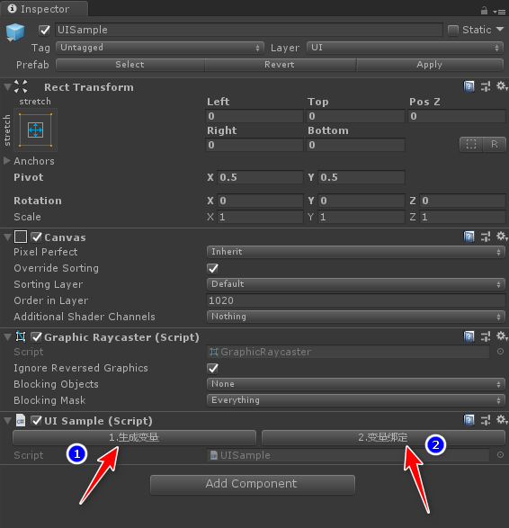
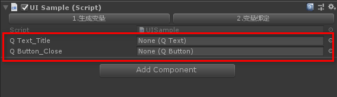

# UGUI自动化--正篇UIBaseGenerate

通过UGUI自动化的前面几篇文章介绍的常用UGUI控件的封装，接下来终于要步入正题了。没错今天就开始介绍如何根据UI控件的名字自动生成变量然后自动将控件和变量序列化。废话不多说，先上图。

## UISample_UI



如上图的界面所示，我们搭建一个简单界面如上所示，一个按钮以及一个界面标题。接下来我们看下其对应的Prefab结构。


请注意Prefab里面的标题QText_Title是以“QText_”开头的，按钮QButton_Close是以“QButton__”开头的。通过这两个特殊的命名规则，我们就可以自动生成对应的界面变量。我们挂上一个界面脚本UISample.cs代码如下

```
using Lemon.UI;
using UnityEngine;

namespace Lemon.UI
{
    public sealed partial class UISample : UIBase
    {

    }
}
```

请注意我们使用了partical关键字，相信读者明白了。没错我们通过这个部分类，来生成另一个脚本UISample_Generate.cs，该脚本里面只保存变量以及对应的序列化的编辑器函数。看到这里可能大家还是比较疑惑，先上图



我们将UISample脚本挂在Prefab的根节点UISample上面，然后按照图上的步骤1和步骤二所示。点击按钮“1.生成变量”




如上所示，根据名字生成了变量，接着我们点击按钮“2.变量绑定”，就会自动将变量序列化上，如下所示。


然后我们发现在UISample的同级目录生成了一个UISample_Generate.cs文件，代码如下

```
/**
*   Author：onelei
*   Copyright © 2019 - 2020 ONELEI. All Rights Reserved
*/
using Lemon.UI;
using UnityEngine;

namespace Lemon.UI
{
    public sealed partial class UISample : UIBase
    {
        //==自动化变量开始
        public QText QText_Title; 
        public QButton QButton_Close; 
 


#if UNITY_EDITOR
        [ContextMenu("GeneratePathEditor")]
        public override void GeneratePathEditor()
        {
            //==自动化路径开始
            QText_Title = CacheTransform.Find("Center/QText_Title/").GetComponent<QText>();
            QButton_Close = CacheTransform.Find("Center/ButtonGroup/QButton_Close/").GetComponent<QButton>();
 
           
        }        
#endif
    }
}
```

上面代码是动态生成的，不需要自己修改。下面我们看如何实现，其实原理很简单，我们根据命名规则（类型在前面，然后加上下划线，后面加上名字。）知道了控件的类型，然后根据该控件相对于脚本的位置来获取路径。为啥要分两个步骤，因为生成了代码需要编译呀~~~

下面我们查看UISample继承的基类UIBase里面的具体写法。

```
/**
*   Author：onelei
*   Copyright © 2019 - 2020 ONELEI. All Rights Reserved
*/
using System.IO;
using System.Collections.Generic;
using System.Text;
using UnityEngine;
using System;

namespace Lemon.UI
{
    public partial class UIBase : BaseMonoUIClass
    {
#if UNITY_EDITOR
        private const string KEY_VARIABLE = "//==自动化变量开始";
        private const string KEY_PATH = "//==自动化路径开始";

        private string UI_TEMPLATE_PATH
        {
            get
            {
                return Application.dataPath + "/Lemon/Scripts/UI/UITemplate/UITemplate_Generate.cs";
            }
        }

        /// <summary>
        /// 自动化组件的前缀和类型
        /// </summary>
        private Dictionary<string, Type> name_type = new Dictionary<string, Type>()
        {
            {"QButton", typeof(QButton)},
            {"QRawImage", typeof(QRawImage)},
            {"QImage", typeof(QImage)},
            {"QText", typeof(QText)},
            {"QToggleButton", typeof(QToggleButton)},
            {"QToggleButtonGroup", typeof(QToggleButtonGroup)}
        };

        private Dictionary<Transform, Type> transformGroup = new Dictionary<Transform, Type>();

        [ContextMenu("GenerateCodeEditor")]
        public void GenerateCodeEditor()
        {
            transformGroup.Clear();
            Transform[] children = CacheTransform.GetComponentsInChildren<Transform>(true);
            for (int i = 0; i < children.Length; i++)
            {
                Transform child = children[i];
                string fullName = child.name;
                string[] tmpName = fullName.Split('_');
                if (tmpName.Length > 1)
                {
                    Type type;
                    if (name_type.TryGetValue(tmpName[0], out type))
                    {
                        transformGroup.Add(child, type);
                    }
                }
            }

            //读取
            StreamReader streamReader = new StreamReader(UI_TEMPLATE_PATH, Encoding.UTF8);
            string ClassText = streamReader.ReadToEnd();
            streamReader.Close();

            //生成
            UIBase uIBase = GetComponent<UIBase>();
            string uiBasePath = StringPool.Format(Application.dataPath + "/Lemon/Scripts/UI/{0}/{1}_Generate.cs", uIBase.name, uIBase.name);
            StreamWriter streamWriter = new StreamWriter(uiBasePath, false, Encoding.UTF8);

            //添加自动化的变量
            StringBuilder stringBuilder = StringPool.GetStringBuilder();
            stringBuilder.Append("\n");
            Dictionary<Transform, Type>.Enumerator enumerator = transformGroup.GetEnumerator();
            while (enumerator.MoveNext())
            {
                string name = enumerator.Current.Key.name;
                Type type = enumerator.Current.Value;
                stringBuilder.Append("        public " + type.Name + " " + name + "; ");
                stringBuilder.Append("\n");
            }

            ClassText = ClassText.Replace("UITemplate", uIBase.name);
            ClassText = ClassText.Replace(KEY_VARIABLE, KEY_VARIABLE + stringBuilder.ToString());

            //添加自动化的变量路径
            stringBuilder = StringPool.GetStringBuilder();
            stringBuilder.Append("\n");
            enumerator = transformGroup.GetEnumerator();
            while (enumerator.MoveNext())
            {
                Transform childTransform = enumerator.Current.Key;
                Type type = enumerator.Current.Value;
                stringBuilder.Append("            " + childTransform.name + " = " + "CacheTransform.Find(\"" + UtilEditor.GetPath(childTransform, CacheTransform) + "\").GetComponent<" + type.Name + ">();\n");
            }

            ClassText = ClassText.Replace(KEY_PATH, KEY_PATH + stringBuilder.ToString());

            streamWriter.Write(ClassText);
            streamWriter.Close();

            UnityEditor.AssetDatabase.Refresh();
        }

        [ContextMenu("GeneratePathEditor")]
        public virtual void GeneratePathEditor()
        {

        }
#endif

    }
}
```

核心函数是GenerateCodeEditor，首先根据命名规则将变量名和类型存储下来，然后通过StreamReader去读取模板脚本UITemplate，每个界面都需要去读取该模板，然后根据自身的脚本UISample去替换掉里面的内容。

我们看下UITemplate.cs

```
/**
*   Author：onelei
*   Copyright © 2019 - 2020 ONELEI. All Rights Reserved
*/
using Lemon.UI;
using UnityEngine;

namespace Lemon.UI
{
    public sealed partial class UITemplate : UIBase
    { 

    }
}
```

UITemplate_Generate.cs

```
/**
*   Author：onelei
*   Copyright © 2019 - 2020 ONELEI. All Rights Reserved
*/
using Lemon.UI;
using UnityEngine;

namespace Lemon.UI
{
    public sealed partial class UITemplate : UIBase
    {
        //==自动化变量开始 


#if UNITY_EDITOR
        [ContextMenu("GeneratePathEditor")]
        public override void GeneratePathEditor()
        {
            //==自动化路径开始 
           
        }        
#endif
    }
}
```

需要注意的是如果有自己定义的控件类型和命名规则，请修改UIBase_Generate.cs脚本的如下内容。

```
        /// <summary>
        /// 自动化组件的前缀和类型
        /// </summary>
        private Dictionary<string, Type> name_type = new Dictionary<string, Type>()
        {
            {"QButton", typeof(QButton)},
            {"QRawImage", typeof(QRawImage)},
            {"QImage", typeof(QImage)},
            {"QText", typeof(QText)},
            {"QToggleButton", typeof(QToggleButton)},
            {"QToggleButtonGroup", typeof(QToggleButtonGroup)}
        };
```

上面是自动化组件的前缀和类型，方便扩展。

详细代码参见：https://github.com/onelei/Lemon/tree/master/Assets/Lemon/Scripts/UI/UIManager 欢迎Star。如果本文对你有所帮助，欢迎赞赏~~~


