# Jenkins自动化打包

## 下载安装

我们直接从官网https://www.jenkins.io/download/ 下载所需的Jenkins文件

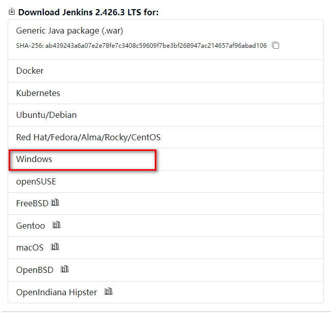

如上图所示, 选择Windows版本,下面就是一路安装即可,需要注意的是,选择作为系统服务选项, 不要自己设置账号密码登录.

## Web配置

安装完根据提示在浏览器打开 http://localhost:8080/ 即可进入Jenkins部署界面

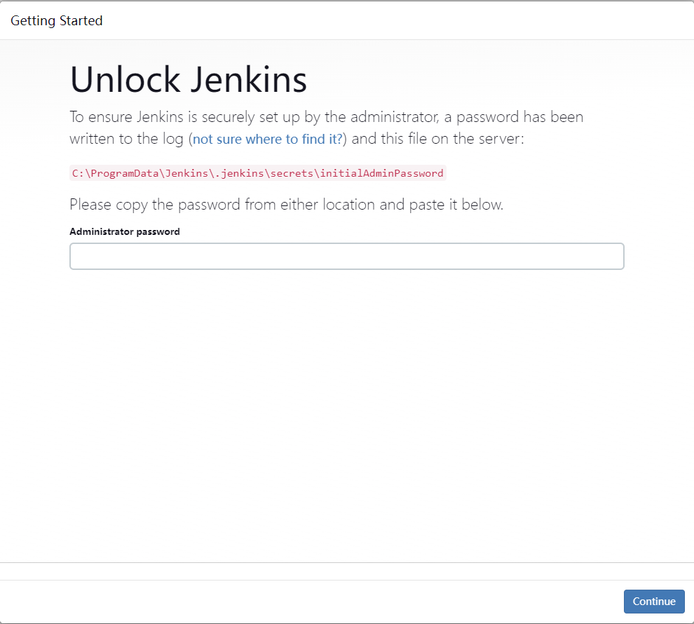

按照上图中的红色路径找到initialAdminPassword文件并打开 将文件内容粘贴进去, 点击继续

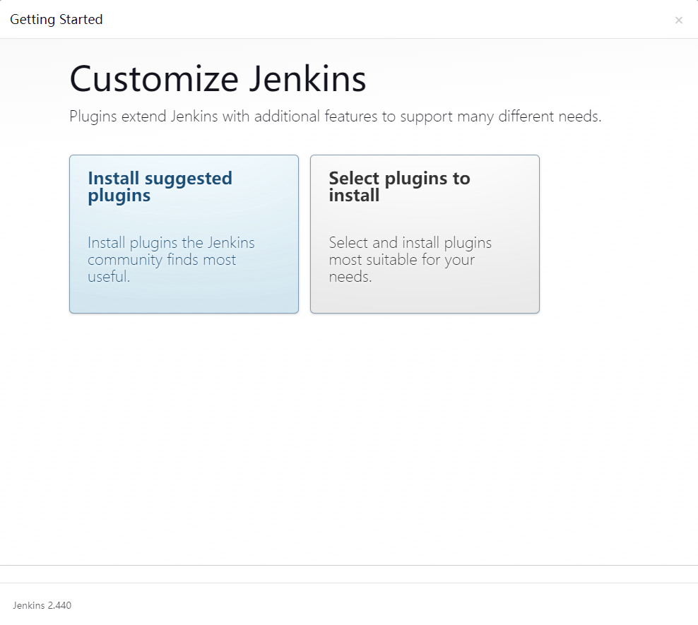

这里我们选择推荐的插件进行安装

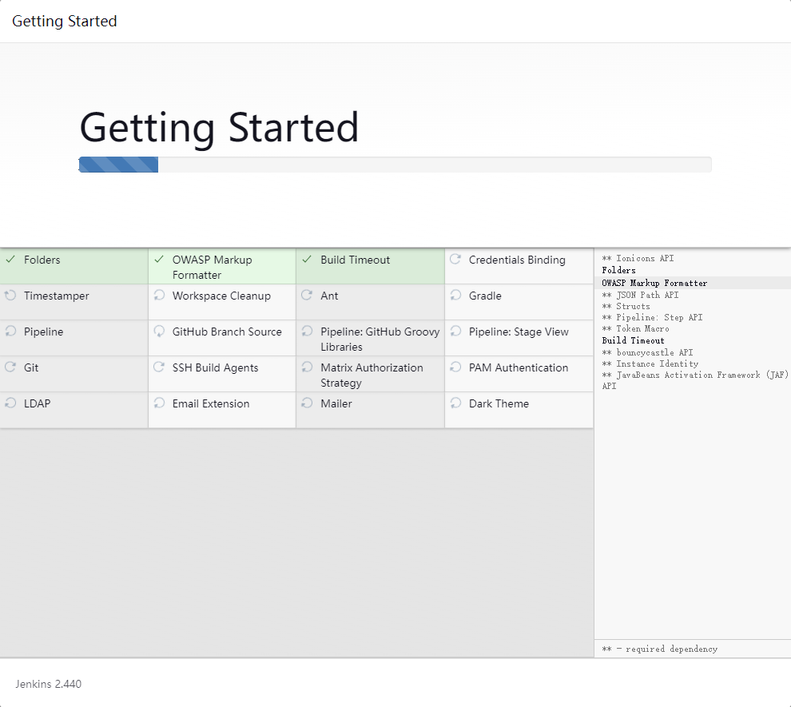

等待进度条跑完即可

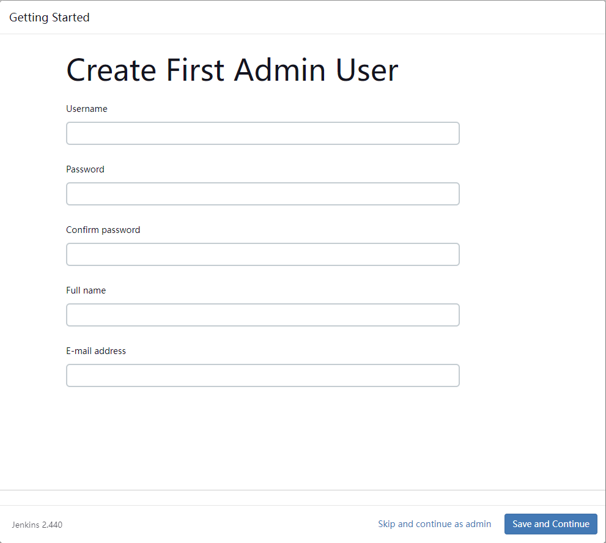

我们选择Skip, 跳过设置继续使用admin用户登录

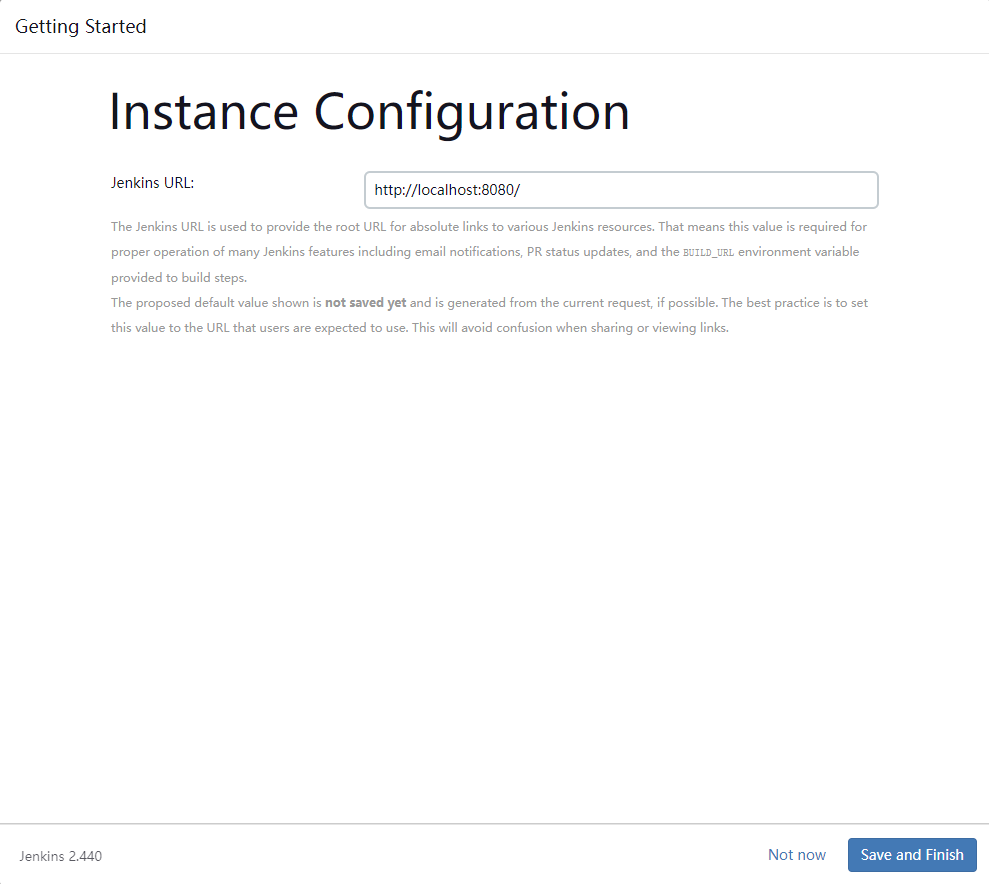

选择Save and Finish

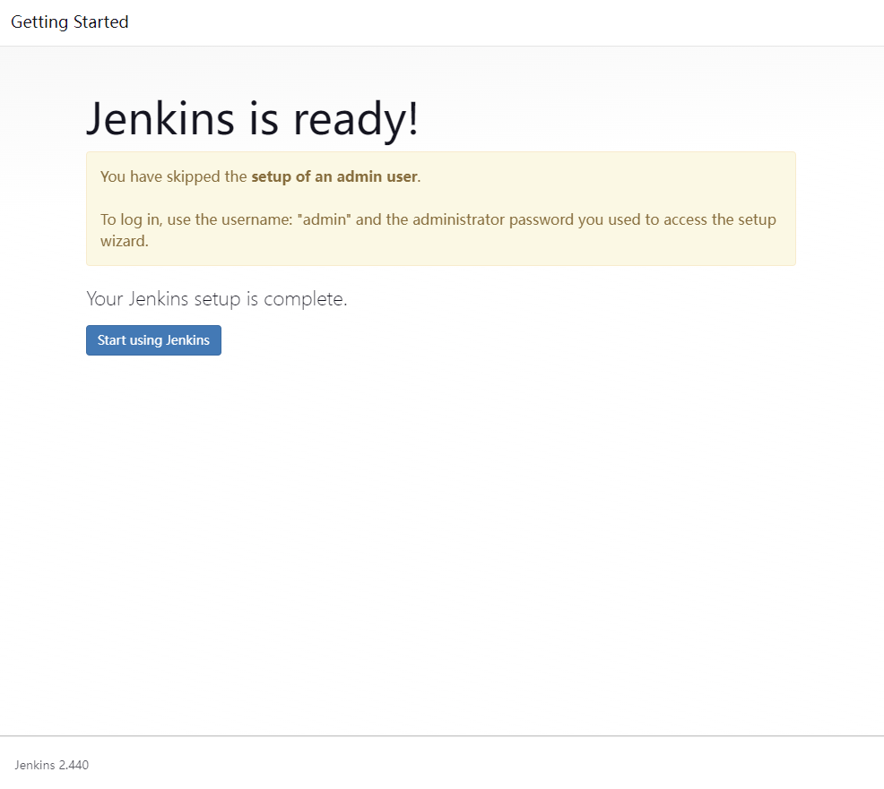

选择Start using Jenkins

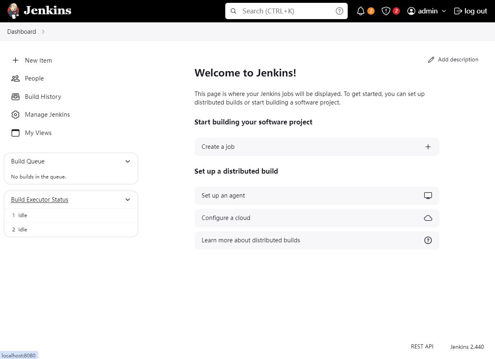

## Unity每日定时打包

就是Jenkins的web界面, 我们在里面配置一个自动打包流程, 比如一个定时任务, 每天凌晨自动打包. 下面就演示如何操作

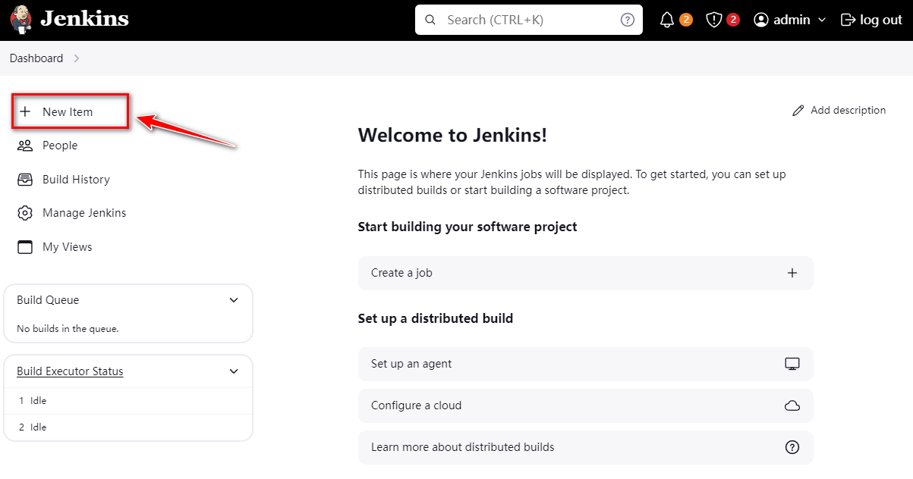

我们选择左边的New Item创建一个任务

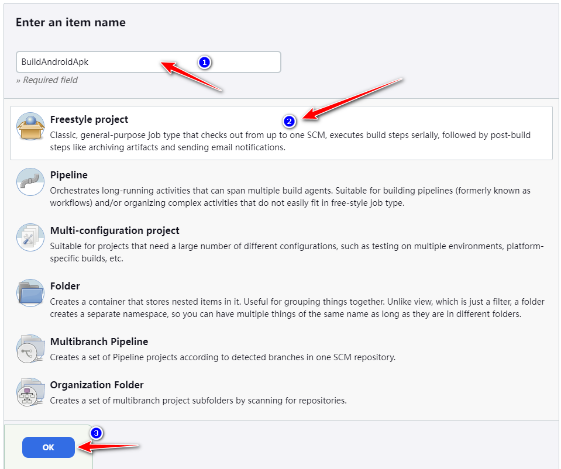

按照上图的步骤1,2,3 点击OK之后创建任务

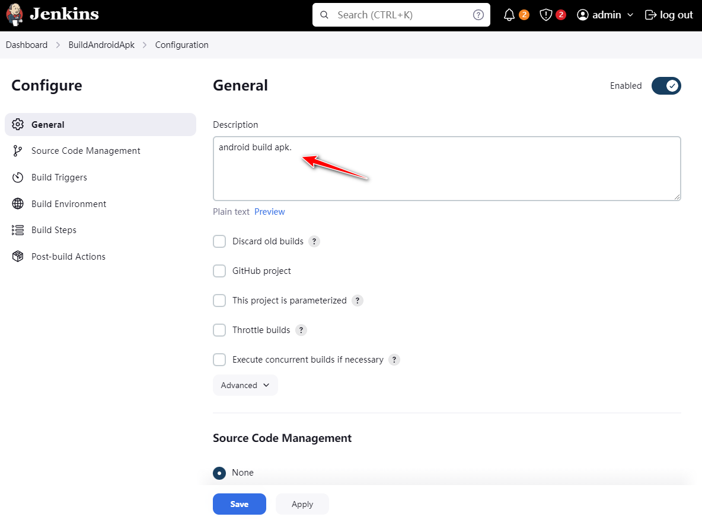

在上图中添加上任务描述, 然后滚动到后面的BuildSteps里面选择Execute Windows batch command

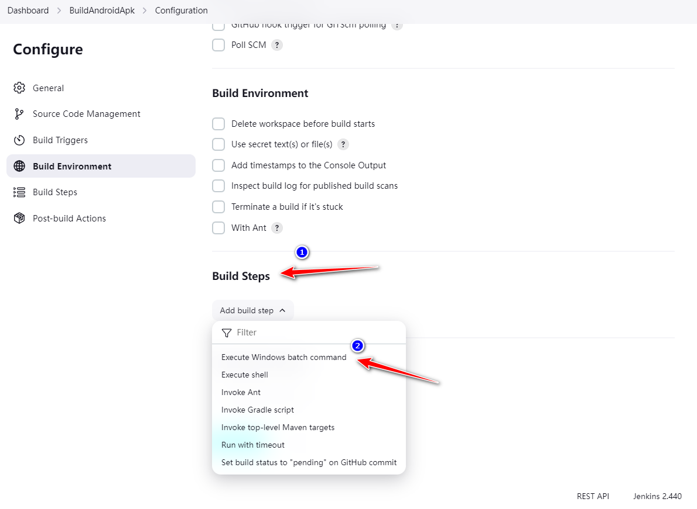

在Command里面填写上要执行的python脚本

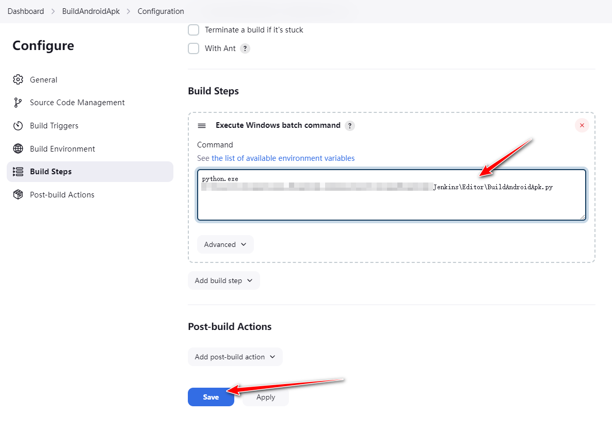

点击Save保存

### 创建打包C#脚本

```c#
using UnityEditor;
using UnityEditor.Build.Reporting;
using UnityEngine;

namespace Jenkins
{
    public class BuildScript
    {
        [MenuItem("Build/Build for Android")]
        public static void BuildForAndroid()
        {
            var buildPlayerOptions = new BuildPlayerOptions()
            {
                scenes = new[]
                {
                    "Assets/LemonFramework/Jenkins/Sample/Sample.unity"
                },
                locationPathName = "Jenkins.apk",
                target = BuildTarget.Android,
                options = BuildOptions.None
            };
            var report = BuildPipeline.BuildPlayer(buildPlayerOptions);
            var summary = report.summary;
            if (summary.result == BuildResult.Succeeded)
            {
                Debug.Log("Build succeeded: " + summary.totalSize + " bytes");
            }

            if (summary.result == BuildResult.Failed)
            {
                Debug.LogError("Build failed");
            }
        }
    }
}
```

### 创建打包Python脚本

```python
#coding:utf-8
import os
import sys
import subprocess
import time
from pathlib import Path
import subprocess
sys.path.append(os.path.abspath(os.path.join(os.path.realpath(__file__), "../")))

CUR_PATH = os.getcwd()
PROJ_PATH = os.path.join(CUR_PATH, "../")
BRANCH = 'gl-master'

# Unity的执行路径
unity_path = "C:/Program Files/Unity/Editor/Unity.exe"
# Unity项目的路径
project_path = "E:/Projects/Lemon/Lemon.Framework.Jenkins"
# 要执行的Unity编辑器自定义方法的名称，这个方法在Unity编辑器扩展脚本中定义
method_name = "Jenkins.BuildScript.BuildForAndroid"
# 打包后的APK文件路径
apk_output_path = "E:/Projects/Lemon/Lemon.Framework.Jenkins/Jenkins.apk"

# 拼接Unity命令行
cmd = [
    unity_path,
    "-quit",  # 表示Unity完成命令后关闭
    "-batchmode",  # 不显示界面和对话框
    "-nographics",  # 在支持的平台上不初始化图形设备
    "-silent-crashes",  # 自动处理崩溃情况
    "-projectPath", project_path,
    "-executeMethod", method_name,
    "-logFile",  # 可以指定日志文件路径，例如"-logFile", "unity.log"
    "-buildOutput", apk_output_path,
]

# 杀掉unity进程
def kill_unity():
    os.system('taskkill /IM Unity.exe /F')

def git_reset_pull():
	os.chdir(PROJ_PATH)
	cmd = 'git fetch --all' #git 拉取命令
	result = os.system(cmd)	
	cmd = 'git reset --hard HEAD' #git reset命令
	result = os.system(cmd)
	cmd = r"{0}{1}".format("git checkout ",BRANCH)
	result = os.system(cmd)
	cmd = 'git clean -fd' #git clean 命令
	result = os.system(cmd)
	cmd = 'git pull --rebase' #git pull命令
	result = os.system(cmd)

	if result == 0:
		print('git update succes')
	else:
		print('git update fail')

# 调用unity中我们封装的静态函数
def build():    
	# 执行命令行
	# subprocess.call(cmd) 注释掉这行，并替换为下面的代码，以阻塞直到命令完成并捕获输出
	process = subprocess.Popen(cmd, stdout=subprocess.PIPE, stderr=subprocess.PIPE)
	stdout, stderr = process.communicate()

	if process.returncode == 0:
		print("Build succeeded")
		print(stdout.decode("utf-8"))  # 显示标准输出
	else:
		print("Build failed")
		print(stderr.decode("utf-8"))  # 显示错误输出
		sys.exit(1)
 
if __name__ == '__main__':	
	now = time.time() 
	kill_unity()
	#git_reset_pull()
	build()
	print(f'total take time {time.time()-now} seconds')
	print("Done!")
```

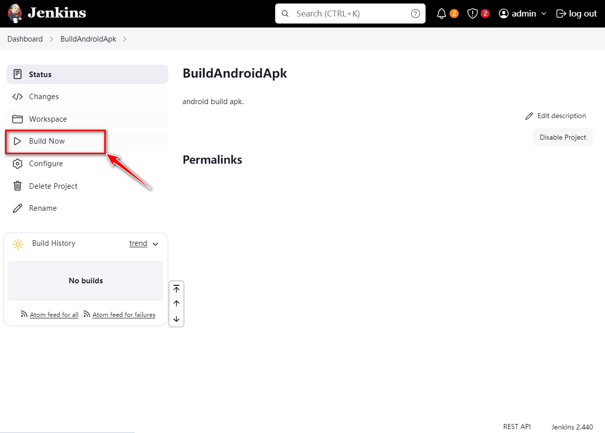

点击左侧Build Now即可生成Android Apk

### 定时任务

在Configure里设定每天早上6点定时打包,这样一大早有有热乎的apk给QA做测试了

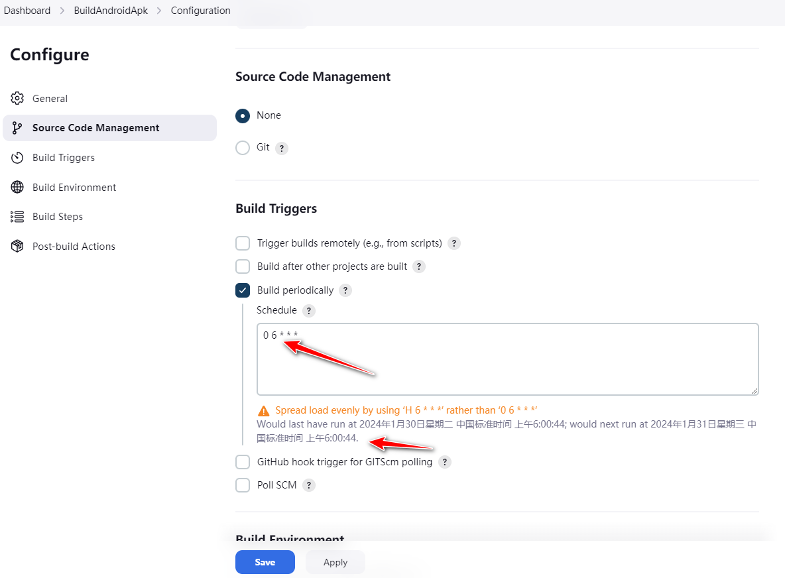