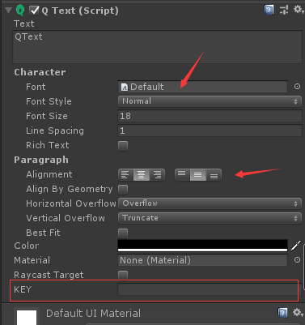

# UGUI自动化--QText

从本篇开始打算写一些Unity的UI自动化相关的文章。自动化的核心思想是根据UI控件的名字自动生成变量然后自动将控件和变量序列化。在开始之前先介绍一下自己封装的文本控件QText，它继承自UGUI的Text组件。为什么要封装一层呢？由于Unity是外国人写的，UGUI的Text组件里面的参数不太符合国内的使用习惯。UGUI的Text组件里面的字体、字号、字体颜色、文本的对齐方式等等一系列参数，都是在添加完Text组件之后手动修改。增加了程序的工作量，因此自己就在Text基础上实现了一套自动设置相关参数的组件QText。还有一个更加重要的原因是Unity的Text做多语言相比较麻烦，具体怎么做呢？下面将详细介绍。

## QText



如上图QText组件所示，我们可以设置默认的字体，默认取消RichText的勾选，默认取消RaycastTarget的勾选，最关键的还是下面的KEY字段。多语言只需要在这个KEY填写该文本对应的多语言KEY，代码里面可以根据语言来读取KEY对应的Value用来显示。下面看如何实现。

新建一个QText.cs代码如下

```
/**
*   Author：onelei
*   Copyright © 2019 - 2020 ONELEI. All Rights Reserved
*/
using UnityEngine;
using UnityEngine.UI;
using System;

namespace Lemon.UI
{
    [AddComponentMenu("UI/QText")]
    public class QText : Text
    {
        [HideInInspector]
        public bool bInit = false;
        /// <summary>
        /// 多语言key
        /// </summary>
        public string key = string.Empty;

        private GameObject _CacheGameObject = null;
        public GameObject CacheGameObject { get { if (_CacheGameObject == null) { _CacheGameObject = gameObject; } return _CacheGameObject; } }

        private Transform _CacheTransform = null;
        public Transform CacheTransform { get { if (_CacheTransform == null) { _CacheTransform = transform; } return _CacheTransform; } }

        public override string text
        {
            get
            {
                return m_Text;
            }
            set
            {
                if (String.IsNullOrEmpty(value))
                {
                    if (String.IsNullOrEmpty(m_Text))
                        return;
                    m_Text = "";
                    SetVerticesDirty();
                }
                else if (m_Text != value)
                {
                    m_Text = value;
                    SetVerticesDirty();
                    SetLayoutDirty();
                }
            }
        }

        public void Refresh()
        {
            if (string.IsNullOrEmpty(key))
                return;
            text = LanguageManager.Instance.Get(key);
        }

        protected override void Awake()
        {
            base.Awake();
        }

        protected override void OnDestroy()
        {
            base.OnDestroy();
            bInit = false;
        }

        protected override void OnEnable()
        {
            base.OnEnable();
            //Refresh();
        }

        protected override void OnDisable()
        {
            base.OnDisable();
        }
    }
}
```

QText组件继承自Unity的Text组件，这点应该都知道。主要是多了如下两个变量

```
        [HideInInspector]
        public bool bInit = false;
        /// <summary>
        /// 多语言key
        /// </summary>
        public string key = string.Empty;
```

第一个bInit是用来初始化变量用的，第二个key就是用于多语言处理的KEY。

接着我们新建一个QTextEditor.cs的脚本，将其放入Editor文件夹下。代码如下

```
/**
*   Author：onelei
*   Copyright © 2019 - 2020 ONELEI. All Rights Reserved
*/
using UnityEditor;
using UnityEngine;

namespace Lemon.UI
{
    [CustomEditor(typeof(QText), true)]
    [CanEditMultipleObjects]
    public class QTextEditor : UnityEditor.UI.TextEditor
    {
        [MenuItem("GameObject/UI/QText", false, UtilEditor.Priority_QText)]
        public static QText AddComponent()
        {
            QText component = UtilEditor.ExtensionComponentWhenCreate<QText>(typeof(QText).Name.ToString());
            //设置默认值
            SetDefaultValue(component);
            return component;
        }

        QText component;
        public override void OnInspectorGUI()
        {
            component = (QText)target;
            base.OnInspectorGUI();
            component.key = EditorGUILayout.TextField("KEY", component.key);
            if (!component.bInit)
            {
                component.bInit = true;
                SetDefaultValue(component);
            }
        }

        private static void SetDefaultValue(QText component)
        {
            if (component == null)
                return;
            component.font = DefaultFont;
            component.supportRichText = false;
            component.raycastTarget = false;
            component.alignment = TextAnchor.MiddleCenter;
            component.horizontalOverflow = HorizontalWrapMode.Overflow;
            component.color = Color.black;
            component.fontSize = 18;
            component.text = "QText";
        }

        private static Font font;
        public static Font DefaultFont
        {
            get
            {
                if (font == null)
                {
                    font = Resources.Load<Font>("Default");
                }
                return font;
            }
        }
    }
}
```

QText通过重写OnInspectorGUI函数，来重新绘制组件的显示。先调用

```
base.OnInspectorGUI();
```

优先绘制Text组件，然后绘制一个TextField用来显示多语言所需要的KEY。

然后我们通过SetDefaultValue函数来重写Text组件里面的参数。详细代码参见：https://github.com/onelei/Lemon/tree/master/Assets/QGUI 欢迎Star。如果本文对你有所帮助，欢迎赞赏~~~


  
